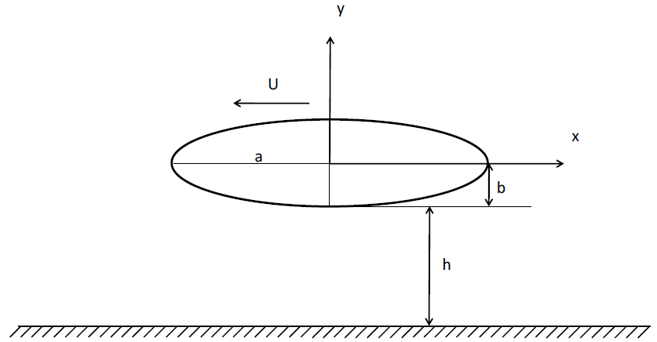

# Hydrodinamics Panel Method

The [Squat effect](http://en.wikipedia.org/wiki/Squat_effect)  is a hydrodynamic phenomenon in which a ship moving rapidly through a shallow water region creates an area of low pressure on its bottom, causing the ship to tend to increase its draft and, with that, potentially collide with the bottom of the region where it navigates.

Using the case described above as motivation, the work consists of applying the panel method for a first estimation of the hydrodynamic forces caused by the advance movement of a fully submerged body that propagates at a speed U at a distance h from the bottom.

Suppose, then, that the body geometry can be modeled by an ellipse of semi-axes a and b as shown in the figure bellow. Consider the value of the vertical semi-axis b = 1; ρ = 1025 kg/m3 and g = (-9.81m/s2) 𝒋⃑. The values of the semi-axis a will be defined by: {a/b = 1.0; 1.5; 2.0; 2.5; 3.0}

## Results

1. Figures representing the panels (grid) and control points used for the computational solution of the problem, indicating the panel numbering convention.

2. Tables with the values of source intensities (σ) of each panel and the flow velocity modules calculated at the control points of the panels.

3. Pressure coefficient graphs on the body for each a/b ratio.

4. Hydrodynamic force (vertical and horizontal) value graphs as a function of the panel number N for numerical convergence evaluation.

5. Hydrodynamic force (horizontal and vertical) graphs as a function of the increase in distance between the body and the wall and the increase in the body's advance speed.

6. Maps (with color scale) illustrating the intensity of the flow velocity field around the ellipse.
